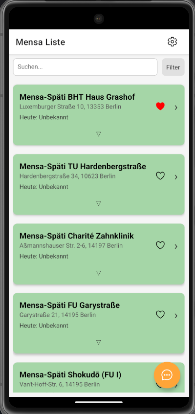
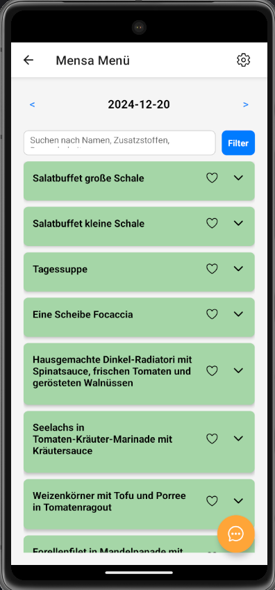

# Mensa-App-Gruppe-5  

Nutze bitte den Main Branch [Main Branch](https://github.com/HTW-PMA/Gruppe-5/tree/main)

## **Entwicklerteam**  
- **Eray Kadem** (587064)  
- **Karim Hamade** (587860)  
- **Maruan Mohamad** (585085)  
- **Alimamy Kamara** (584451)  


## **Systemanforderungen**  
- **Expo**: Version `52.0.0`  

- **Node.js**: Version `~v18.20` (*Empfohlen*: `v18.20.4` für exakte Reproduktion)  


## **Vorbereitung**  
1. Öffne die Datei `.env.example` und trage die erforderlichen **API-Keys** ein.  

2. Benenne die Datei von `.env.example` in `.env` um.  


## **Ausführen**  
1. Installiere die Abhängigkeiten:  
   ```bash
   npm install
   ```
2. Starte die Anwendung:
   ```bash
   npx expo start
   ```
<br>

## **API-KEYS** 

- API_KEY von https://mensa.gregorflachs.de/swaggerdoku
- AI_KEY von https://aistudio.google.com/u/1/apikey

<br>

## **INFO** 
- Die Mensa-API enthält keine Mahlzeiten-Daten nach dem 20.12.2024.  
Um die verfügbaren Mahlzeiten anzuzeigen, drücken Sie in der App wiederholt nach links, bis der **20.12.2024** erreicht ist.

- Falls die App im Emulator nicht richtig ladet dann bitte die App einmal schließen und über die Expo App manuell Öffnen

- Falls die App einen Fehlercode mit "Text" anzeigt bitte Ignorieren

## **Nachweis** 
Falls die App aus unerklärlichen Gründen nicht funktioniert, tragen Sie bitte den Fehlercode sowie eine Beschreibung, wie der Fehler entstanden ist, im **Issues**-Bereich ein:  
[GitHub Issues - Gruppe 5](https://github.com/HTW-PMA/Gruppe-5/issues)


Hier sind Screenshots die Beweisen dass es funktioniert:



